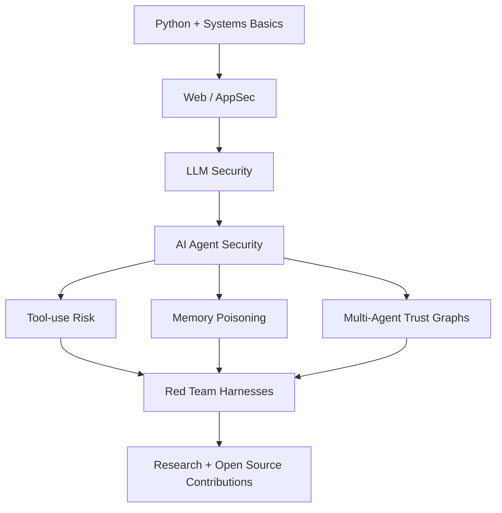

<div align="center">

# Yury Popov

### AI Agent Security · LLM Red Teaming · Strange Systems That Should Not Be Trusted Blindly


<br/>

[](https://github.com/iluvcashnhash)
[](https://github.com/iluvcashnhash)
[](#)

</div>

---

## What I am trying to become

I am an undergraduate student in the HSE x Kyung Hee University double-degree track, building my way into **AI security**.

My main obsession is simple:

> AI agents are not just chatbots.  
> They are software systems with memory, tools, permissions, incentives, hidden context, and failure modes.  
> That makes them a security problem.

I care about:

- prompt injection and indirect prompt injection
- LLM application security
- unsafe tool use and confused-deputy failures
- memory poisoning and RAG integrity
- multi-agent systems security
- agent red teaming
- trust propagation in agent networks
- graph anomaly detection for agent swarms
- collusion and hidden coordination between autonomous systems

I am not here to pretend I already have everything figured out.  
I am here to build, break, document, and get dangerous enough to be useful.

---

## Current direction

```txt
AI Agent Security
├── LLM red teaming
│   ├── jailbreaks
│   ├── prompt injection
│   └── evaluation harnesses
├── Tool-use security
│   ├── MCP / function calling
│   ├── unsafe delegation
│   └── action boundary failures
├── Memory and context attacks
│   ├── poisoned memories
│   ├── malicious documents
│   └── RAG corruption
└── Multi-agent systems
    ├── trust graphs
    ├── anomaly detection
    └── collusion prevention
```

---

## Things I want to build

| Project idea | Why it matters |
|---|---|
| **Vulnerable AI Agent Lab** | A deliberately insecure agent with tools, memory, and RAG for red-team practice |
| **Agent Red-Team Test Suite** | Prompt injection, tool misuse, memory poisoning, and exfiltration tests mapped to OWASP / MITRE ATLAS |
| **Memory Poisoning Playground** | Persistent attacks against long-term agent memory |
| **Tool-Call Firewall** | A small monitor that scores and blocks suspicious agent actions |
| **Multi-Agent Trust Graph** | Detecting abnormal coordination, privilege spread, and rogue-agent behavior |
| **AI Security Reports** | Short, reproducible writeups instead of vague AI safety opinions |

---

## Tech I use or am learning

<div align="center">


</div>

---

## Repositories worth checking

- [**Social-Space-for-Agentic-Systems**](https://github.com/iluvcashnhash/Social-Space-for-Agentic-Systems)  
  Early work around agentic systems, social structure, and coordination.

- [**telegramtextparser**](https://github.com/iluvcashnhash/telegramtextparser)  
  Python tooling for parsing Telegram text data.

- [**time-travel-exec-compile**](https://github.com/iluvcashnhash/time-travel-exec-compile)  
  Weird experiments are often where useful ideas start.

- [**Tragictory-Physics**](https://github.com/iluvcashnhash/Tragictory-Physics)  
  Exploration-heavy repo. Not everything has to be neat before it becomes interesting.

---

## My current learning map



---

## What I am looking for

I am open to:

- AI security research assistant work
- LLM red-teaming projects
- open-source AI security tooling
- junior / internship roles in AI security or AppSec
- labs, fellowships, and weird research groups
- people building things at the edge of agents, security, and systems

Especially if the work involves:

```txt
agents + tools + memory + adversaries + logs + graphs + uncomfortable edge cases
```

---

## Contact

<div align="center">

[](https://github.com/iluvcashnhash)
[](mailto:cashnhash@proton.me)

</div>

---

<div align="center">

### The agent is not aligned until the logs survive contact with an adversary.

</div>
