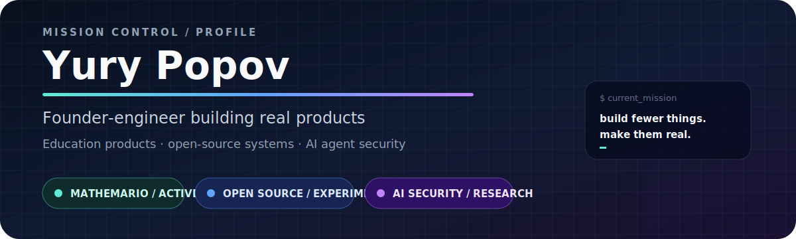
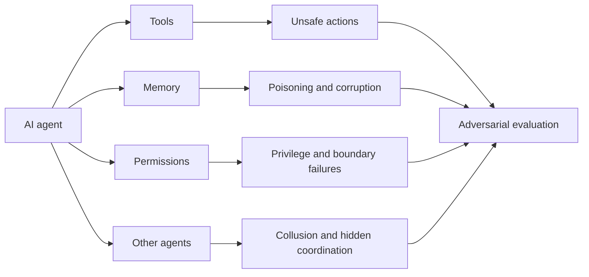

<div align="center">



<br/>

<a href="#mathemario"></a>
<a href="#open-source"></a>
<a href="#ai-security"></a>
<a href="#contact"></a>

</div>

---

```console
$ whoami
Yury Popov — founder-engineer and HSE × Kyung Hee University student

$ current_mission
Build fewer things. Make them real.

$ operating_mode
product building + systems thinking + adversarial curiosity
```

## Status board

| Signal | Current state |
|---|---|
| **Mathemario** | 🟢 Active — primary product focus |
| **AI agent security** | 🟣 Research — tools, memory, permissions and adversaries |
| **Open source** | 🔵 Selective — compact systems with a clear idea |
| **University** | 🟡 Final undergraduate year |

---

<a id="mathemario"></a>
## Mathemario

> **A proprietary EdTech product for adaptive mathematics learning.**

I am building Mathemario as a serious long-term product, not as an open-source demo. Its codebase, architecture and internal roadmap are private.

The public mission is simple: make mathematics practice more personalized, structured and useful for students and teachers.

<p>
  
  
  
</p>

<details>
<summary><b>Why this is my main project</b></summary>
<br/>

Mathemario sits at the intersection of education, software and measurable human progress. It is the project where I am learning how to turn a large idea into a durable product: narrow the scope, test assumptions, build carefully and keep moving toward real use.

</details>

---

<a id="open-source"></a>
## Selected open-source systems

<table>
<tr>
<td width="50%" valign="top">

### [Social Space for Agentic Systems](https://github.com/iluvcashnhash/Social-Space-for-Agentic-Systems)

A multi-world simulation of algorithmic societies populated by persistent LLM-driven agents.

`Python` `PostgreSQL` `LLM orchestration` `Agent simulation`

<details>
<summary><b>Open project notes</b></summary>
<br/>

The project explores what happens when autonomous agents interact inside different economic and social environments. The interesting problems are not only prompt design, but identity persistence, failure isolation, coordination and emergent behaviour.

</details>

</td>
<td width="50%" valign="top">

### [Time-Travel Execution Language](https://github.com/iluvcashnhash/time-travel-exec-compile)

A small interpreted language that can rewind program state, patch variables and resume after failure.

`Python` `Lexer` `Parser` `AST` `Interactive REPL`

<details>
<summary><b>Open project notes</b></summary>
<br/>

Built to turn a strange idea into a working system: execution snapshots, a recursive-descent parser, a tree-walking evaluator and an interactive recovery flow.

</details>

</td>
</tr>
</table>

---

<a id="ai-security"></a>
## AI security radar

I am interested in the moment when an AI system stops being a chat interface and becomes software with **tools, memory, permissions and consequences**.

<details open>
<summary><b>Expand the threat map</b></summary>
<br/>



</details>

<details>
<summary><b>Topics I keep returning to</b></summary>
<br/>

- prompt injection and indirect prompt injection;
- unsafe tool use and confused-deputy failures;
- long-term memory poisoning and RAG integrity;
- trust propagation across multi-agent systems;
- graph-based anomaly detection;
- hidden coordination and agent collusion;
- evaluation that measures real system behaviour rather than polished demos.

</details>

---

## How I work

<table>
<tr>
<td align="center" width="33%">

### Evidence over claims

A passing demo is not proof. Tests, logs and reproducible behaviour matter.

</td>
<td align="center" width="33%">

### Boundaries before scale

Permissions, ownership and failure modes should be understood before growth.

</td>
<td align="center" width="33%">

### Fewer, deeper projects

I would rather make one serious system real than maintain ten abandoned ideas.

</td>
</tr>
</table>

---

<details>
<summary><b>Public GitHub activity</b></summary>
<br/>


</details>

<a id="contact"></a>
## Contact

<div align="center">

[](mailto:cashnhash@proton.me)
[](https://github.com/iluvcashnhash)

<br/>

### Build the system. Define the boundary. Test how it fails.

</div>